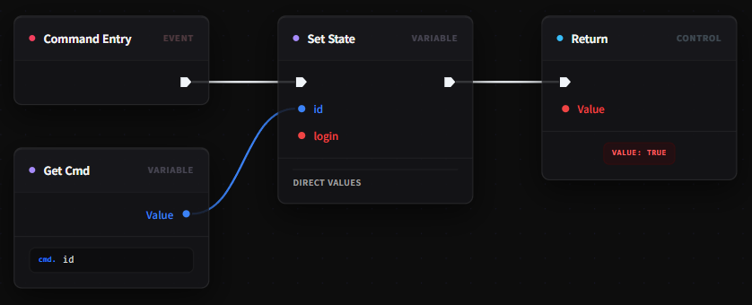
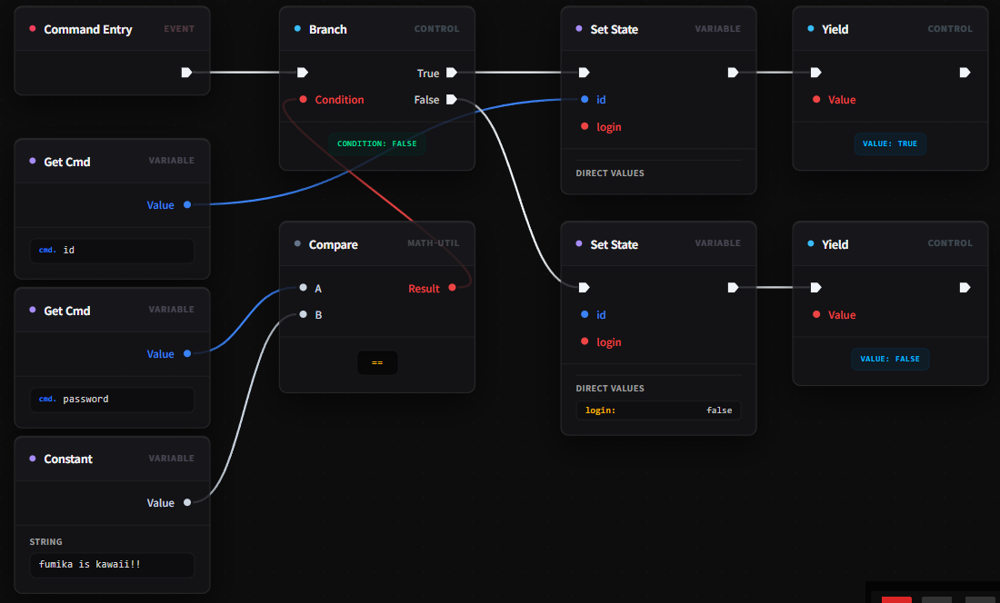
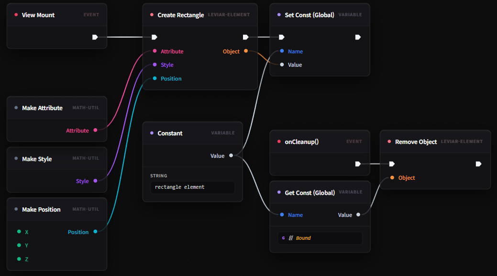

# Leviar 블루프린트 가이드

이 페이지에서는 Leviar 비주얼 노벨 엔진에서 사용하는 블루프린트 비주얼 스크립팅의 핵심 개념과 동작 원리를 배웁니다.  
당신은 코드를 한 줄도 작성하지 않고도 화려한 씬 흐름과 시각 요소를 제어할 수 있습니다.  

---

## 왜 블루프린트가 필요한가요?

기존의 방식대로 씬 커맨드와 시각 효과 뷰를 제작하려면 복잡한 타입스크립트 보일러플레이트 코드를 매번 작성해야만 했습니다.  
이러한 단순 반복 작업은 기획의 흐름을 끊고 사소한 문법 에러로 실행이 막히는 문제를 만듭니다.  

### ❌ 기존의 복잡한 수동 코드 작성 방식
```ts
import { define } from 'fumika'

export default define({
  // 단순한 연출을 위해 매번 커맨드와 뷰를 수동으로 타이핑해야 했습니다.
})
  .defineCommand(function* (cmd, ctx, state, setState) {
    if (cmd.type === 'showText') {
      setState({ text: cmd.text })
      yield { action: 'wait' }
    }
    return true
  })
  .defineView((ctx, state, setState) => {
    return {
      show: () => {},
      hide: () => {}
    }
  })
```

### ✅ 블루프린트를 활용한 직관적인 제어
블루프린트를 사용하면 복잡한 타입 선언 없이 노드를 드래그 앤 드롭으로 연결하여 동작을 완성할 수 있습니다.  
기본적인 구조는 IDE의 컴파일러가 조용히 처리해 주니 걱정하지 마세요.  
우리는 오직 연출의 흐름과 상태의 변화에만 온전히 집중해 봅시다.  

---

## 기본 사용법

블루프린트의 가장 단순한 제어 흐름은 `Command Entry`에서 시작해 `Return` 노드로 끝나는 구조입니다.  
먼저 가장 단순한 연출 흐름을 연결해 볼까요?  



1. **에디터 탭 선택**: 모듈 에디터 상단에서 `Command` 탭을 활성화하세요.  
2. **진입점 노드 배치**: 화면에 생성되어 있는 `Command Entry` 노드를 확인하세요.  
3. **노드 연결**: 마우스 우클릭으로 노드 메뉴를 열고 `Return` 노드를 추가한 뒤, 실행 핀(▶)을 서로 연결하세요.  

> [!NOTE]
> `Command Entry` 노드는 `defineCommand`가 시작되는 유일한 진입점입니다.  
> 이 노드는 그래프당 반드시 하나만 존재해야 하는 싱글톤 노드입니다.  

---

## 점진적 심화

이제 단순한 흐름을 넘어서서, 조건에 따라 분기하고 실제 화면에 도형 엘리먼트를 동적으로 생성하는 흐름을 배워 봅시다.  
점진적으로 복잡한 기능을 추가해 가며 노드를 확장해 나갈 수 있으니 긴장할 필요 전혀 없습니다.  

### 1단계: 조건 분기 (`Branch`) 추가하기
두 값을 비교하여 결과에 따라 서로 다른 실행 흐름을 타도록 구성할 수 있습니다.  
여기서 `Compare` 노드와 `Branch` 노드를 조립해 봅시다.  

<p align="center">
  
  
</p>

- `Compare` 노드의 `Result` 데이터 핀을 `Branch` 노드의 `Condition` 입력 핀에 연결해 보세요.  
- 비교 결과가 `True`일 때 실행할 노드와 `False`일 때 실행할 노드를 나누어 연결해 줍니다.  

> [!TIP]
> `Compare` 노드는 두 값의 크기 비교뿐만 아니라 일치 여부(`==`, `!=`)도 손쉽게 판별할 수 있습니다.  

### 2단계: 화면에 사각형 엘리먼트 생성하기
이제 단순한 값 계산을 넘어 화면에 실제 시각적 요소를 띄워 볼까요?  
`View` 탭을 선택하고 `Create Rectangle` 노드를 활용해 봅시다.  

```ts
// 블루프린트 컴파일러가 뒷단에서 아래와 같은 렌더링 코드를 자동으로 빌드해 줍니다.  
// 내부 구조는 복잡하지만 당신이 직접 타이핑할 필요는 없습니다.  
ctx.world.createRectangle({
  attribute: { gravityScale: 0.1 },
  style: { width: 100, height: 100, background: '#3498db' }
})
```

1. **데이터 조립**: `Make Attribute` 노드와 `Make Style` 노드를 추가합니다.  
2. **속성 연결**: 조립된 `Attribute`와 `Style` 출력을 `Create Rectangle` 노드의 입력 핀에 각각 꽂아 줍니다.  
3. **화면 갱신**: `exec-in` 실행 핀에 흐름이 닿는 순간, 당신이 설계한 사각형이 화면에 즉시 렌더링됩니다.  

> [!WARNING]
> 시각적 오브젝트 생성 노드(`Create Rectangle`, `Create Text` 등)는 반드시 `View` 탭에서만 사용할 수 있습니다.  
> `Command` 탭에 배치하면 빌드 타임에 에러가 발생하니 연결 시 꼭 확인하세요.  

---

## 다음 단계

블루프린트의 기본 흐름을 파악했다면, 이제 상세 사양을 학습할 준비가 완료된 것입니다.  
다양한 노드들의 세부 핀 종류와 컴파일 데이터 포맷에 대해 알고 싶다면 아래 명세서를 참조해 보세요.  

- [블루프린트 레퍼런스](./blueprint-reference.md)로 이동하기  
